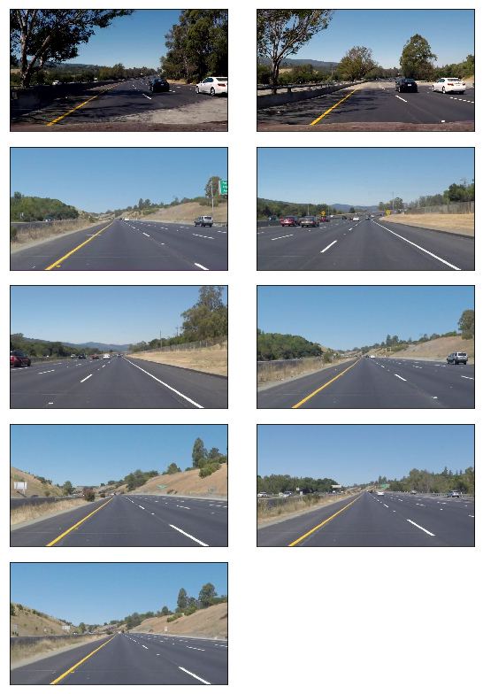
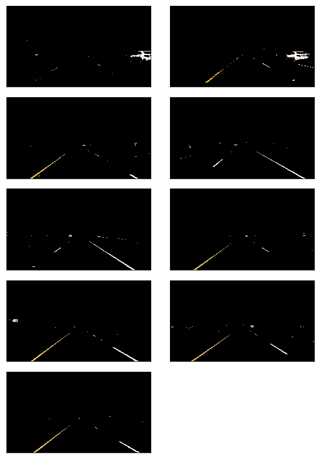
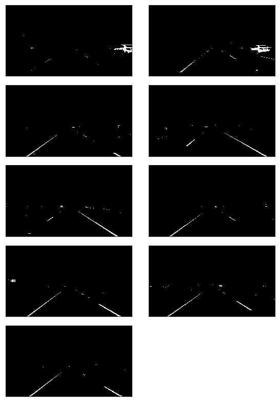
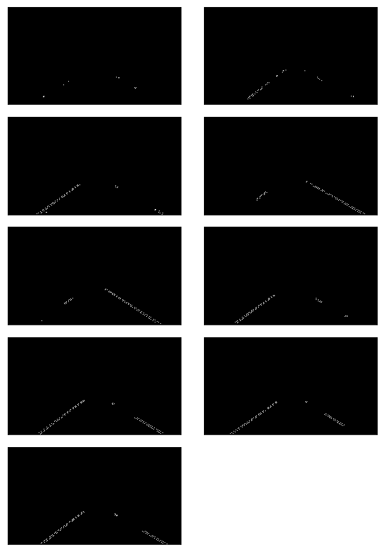
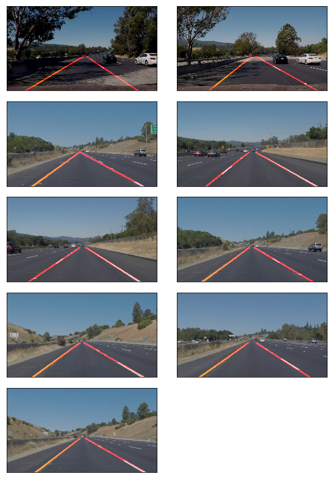

# **Finding Lane Lines on the Road** 

## Writeup Template

### You can use this file as a template for your writeup if you want to submit it as a markdown file. But feel free to use some other method and submit a pdf if you prefer.

---

**Finding Lane Lines on the Road**

The goals / steps of this project are the following:
* Make a pipeline that finds lane lines on the road
* Reflect on your work in a written report


[//]: # (Image References)

[image1]: ./examples/grayscale.jpg "Grayscale"

---

### Reflection

### 1. Describe your pipeline. As part of the description, explain how you modified the draw_lines() function.

My pipeline consisted of 5 steps:

- Filter image color based on selected color mask
- Convert the images to grayscale
- Perform Gausian smoothing and apply edge detection
- Select region of interest to search for lane lines inside it
- Apply Hough transform to find line segments
- Extrapolating the lane from the line segments provided by the Hough transform


In order to draw a single line on the left and right lanes, I performed next steps:

- Calculate a slope, intercept and length of each line
- Based on the slope, sort it into left or right lane line (```slope < 0``` for the left line, because Y grows from the top to the bottom)
- Calculate weighted arithmetic mean for slope, intercept to give more weight to the longer lines
- Found bottom of the image from the image shape (```image.shape[0]```)
- Extrapolate average left and right lane line based on Y axis to 40% of original image Y size, starting from the bottom (```Y = image.shape[0] * 0.6```, where Y grows from the top to the bottom)
- Calculate ```(x1, y1), (x2, y2)``` of average right and left lane line based on slope, intercept parameters and ```y1, y2``` coordinates from the previous step


Below list of images generated on each step:

#### Original Images


#### Filtered Images


#### Grayscale Images


#### Smooth Gray Images


#### Detected Edges


#### Detected Edges within ROI


#### Lane Lines



### 2. Identify potential shortcomings with your current pipeline

Color filters and ROI polygon – are weak points in the lane lines detection implementation:
  - Different lighting conditions, dirty road may affect final result
  - If car begins to change the lane, eventually only one lane line will be detected in ROI
  - If yellow or white car appears in ROI it will cause lots of noice


### 3. Suggest possible improvements to your pipeline

- Auto-adapt existing parameters based on environment characteristics
- Avarage a lane lines based on the (x1, y1), (x2, y2) of the previous video frames
- Take more parameters into account to understand better environment
